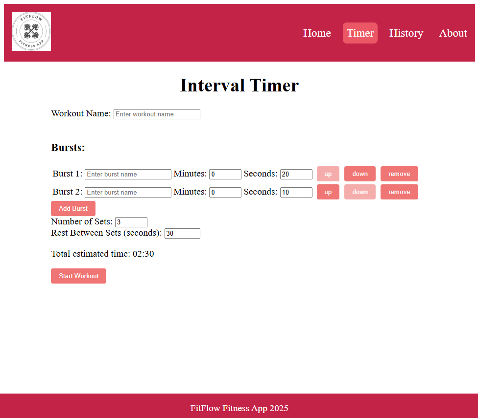

[Home](index.md)
[Resume](resume.md)
[Projects](projects.md)

FitFlow Fitness — LaunchCode Capstone Project (2025)
* A fitness web application containing a customizable interval timer and a history list
* Implemented an Interval Timer where users change adjust settings with useStates
* Developed automated workout logging with useEffect hooks to store data
* HTML, CSS, JavaScript, React, Vite, GitHub Pages

[FitFlow Repo](https://github.com/jennyoleary87/unit1-project-fitness-jennifer-o.git)

